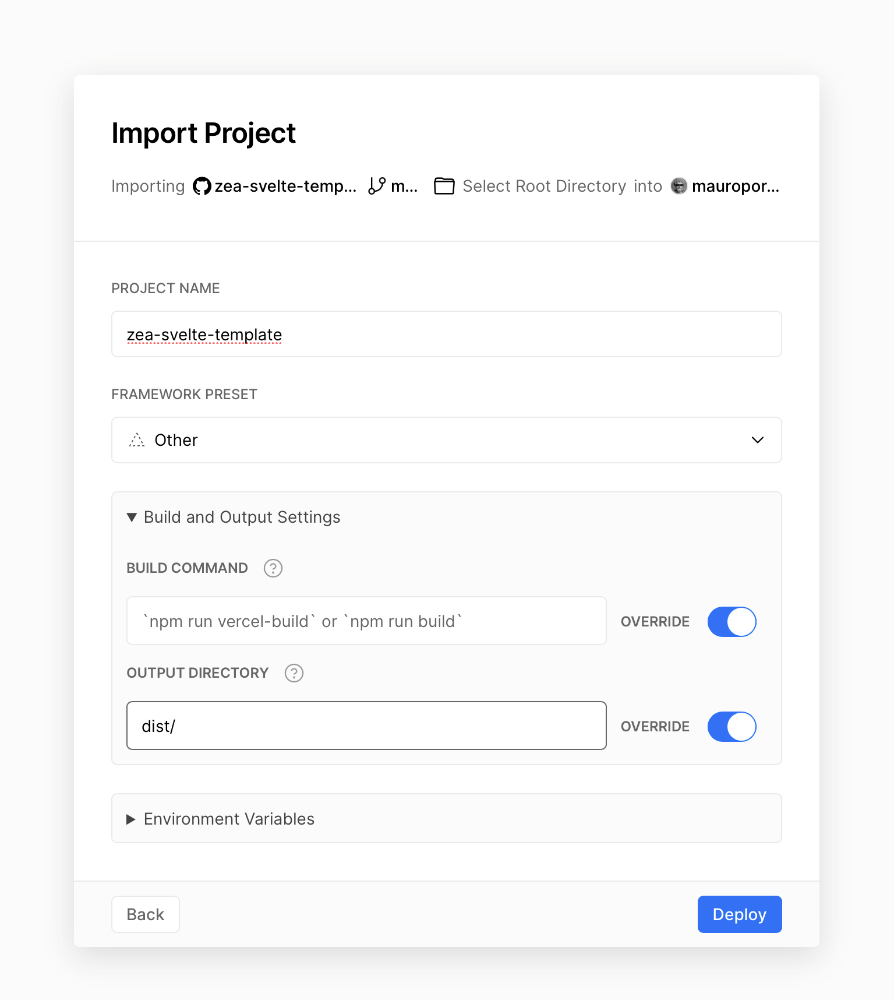

# Zea Svelte Template

## Features

- Built on top of [Svelte](https://svelte.dev/), a radical new approach to building user interfaces.
- Includes the latest stable versions of the Zea tools: [Zea Engine](https://docs.zea.live/zea-engine/), [Zea UI](https://web-components.zea.live/), [Zea UX](https://docs.zea.live/zea-ux/), and [Zea Collab](https://docs.zea.live/zea-collab/).
- Supports [SSR](https://en.wikipedia.org/wiki/Server-side_scripting).

## Prerequisites

To get this template working, you're going to need [Node.js](https://nodejs.org/en/download/) (preferably the latest LTS version).

## Getting Started

Our recommended way to clone this template is by using [degit](https://github.com/Rich-Harris/degit), a project scaffolding tool.

1. Run this command on your terminal:

```bash
npx degit zeainc/zea-svelte-template#main my-awesome-app
```

2. The above command will create the `my-awesome-app` directory for you. Go into it:

```bash
cd my-awesome-app
```

3. Install the project's dependencies by running:

```bash
npm install
```

4. Start a development server by running:

```bash
npm run dev
```

5. Use your browser to go to: http://localhost:5000/

6. Build something awesome.

### npm scripts

| Syntax  | Description                                                      |
| ------- | ---------------------------------------------------------------- |
| `build` | Build a bundled app with SSR + pre-rendering and dynamic imports |
| `dev`   | Development (port 5000)                                          |
| `serve` | Run after a build to preview. Serves SPA on 5000 and SSR on 5005 |

# Features

## UI

The template app leverages the Zea UI library for all its User interface components.

> http://web-components.zea.live/

The UI library is built using the new 'web components' technology supported in all modern browsers.

## UX

The template leverages the Zea UX library to provide Undo, Redo and tools such as selection manager, transform tools.

> https://docs.zea.live/zea-ux

## User Identification and Authentication

This template app comes with a simple user identification and authentication system. Users enter their name and an optional password to gain access to the app.

```javascript
onMount(async () => {
  const isAuthenticated = await auth.isAuthenticated()
  if (!isAuthenticated) {
    $redirect('/login')
  }
})
```

The Authentication can be disabled by commenting out the $redirect('/login') line in the index.svelte file.

> Note: the 'auth.js' file is designed to support integrating other authentication systems provided by frameworks such as Firebase or Auth0.

## Collaboration

If a user is identified, then the app integrates the powerful collaboration framework refrred to as 'Collab.

> https://docs.zea.live/zea-collab/

```javascript
const SOCKET_URL = 'https://websocket-staging.zea.live'
const ROOM_ID = 'zea-template-collab'
```

> Note: the roomID is what defines whether users of a given app are visible to each other. Always customize this value to avoid collisions with other apps.

```javascript
const session = new Session(userData, SOCKET_URL)
session.joinRoom(ROOM_ID)
const sessionSync = new SessionSync(session, appData, userData, {})
```

## CAD

the Zea CAD library comes pre-integrated and a sample zcad file is loaded.

> https://docs.zea.live/zea-cad/

```javascript
const asset = new CADAsset()
asset.getGeometryLibrary().on('loaded', () => {
  renderer.frameAll()
})
scene.getRoot().addChild(asset)
asset.getParameter('FilePath').setValue('/assets/HC_SRO4.zcad')
```

The code above loads the sample cad file.

# Deploying

Varcel is a great platform for quickly deploying SPAs (Single Page Applications) without needing to setup your own infrastructure.

In a few clicks you can connected Varcel to your GitHub repository, at which point Varcel will update your published web app on every push to your main branch.

https://vercel.com/

1. The first step is to sign up to Varcel using your GitHub account, or whatever Git platform you can use.
   

2. Connect Varcel to the github repo containing the app built using this template
   

3. 

4. 

5. 

6. 

## Issues?

File it on Github: https://github.com/ZeaInc/zea-svelte-template

Start a discussion: https://github.com/ZeaInc/zea-svelte-template/discussions
