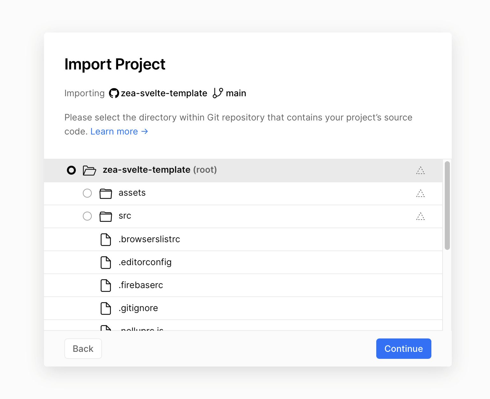
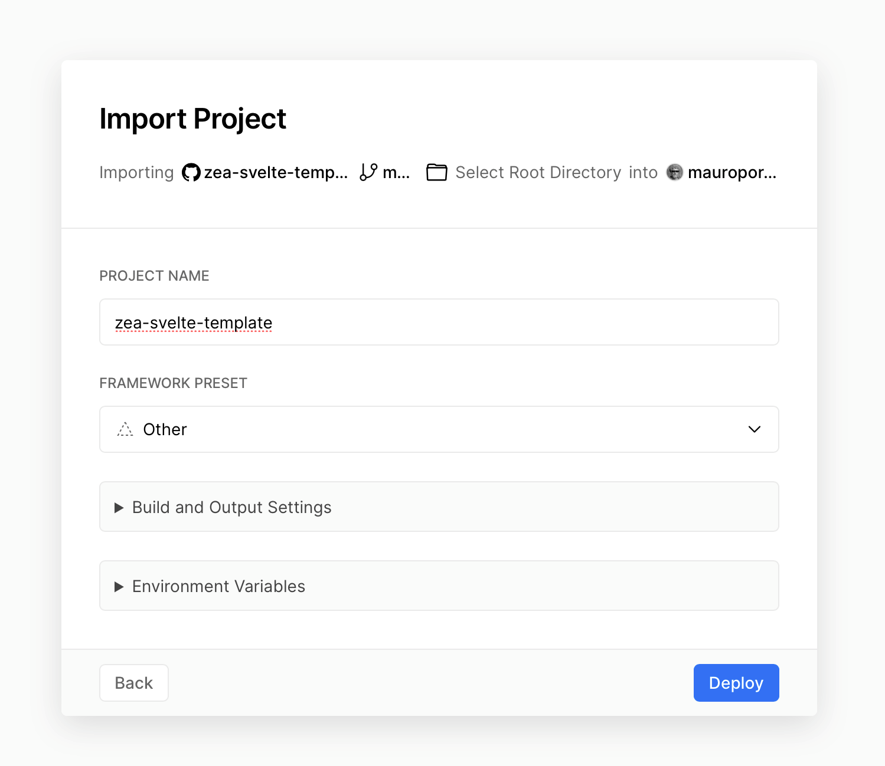
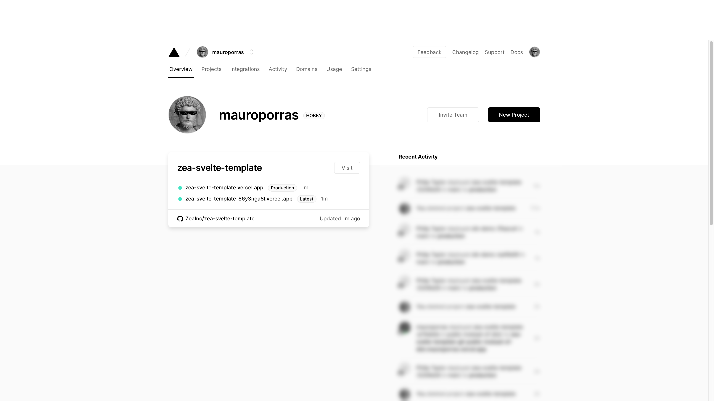

# Zea Svelte Template

## Features

- Built on top of [Svelte](https://svelte.dev/), a radical new approach to building user interfaces.
- Includes the latest stable versions of the Zea tools: [Zea Engine](https://docs.zea.live/zea-engine/), [Zea UI](https://web-components.zea.live/), [Zea UX](https://docs.zea.live/zea-ux/), and [Zea Collab](https://docs.zea.live/zea-collab/).

## Live Demo

This template has been deployed as a live demo for you to check out now.

> Password: zea

You can change the password in your own deployments, or connect to an authentication service.
See below.


https://svelte-template.zea.live/?zcad=data/gear_box_final_asm.zcad

https://svelte-template.zea.live/?zcad=data/Fidget-Spinner-2.zcad

https://svelte-template.zea.live/?zcad=data/HC_SRO4.zcad


You can also modify the app to load parts of the hospital.


https://svelte-template.zea.live/?zcad=/data/Hospital/Autodesk_Hospital_Structural.zcad

https://svelte-template.zea.live/?zcad=/data/Hospital/Autodesk_Hospital_HVAC.zcad

## Prerequisites

To get this template working, you're going to need [Node.js](https://nodejs.org/en/download/) (preferably the latest LTS version).

## Getting Started

Our recommended way to clone this template is by using [degit](https://github.com/Rich-Harris/degit), a project scaffolding tool.

1. Run this command on your terminal:

```bash
npx degit zeainc/zea-svelte-template#main my-awesome-app
```

2. The above command will create the `my-awesome-app` directory for you. Go into it:

```bash
cd my-awesome-app
```

3. Install the project's dependencies by running:

```bash
npm install
```

4. Start a development server by running:

```bash
npm run dev
```

5. Use your browser to go to: http://localhost:5000/

6. Build something awesome.

### npm scripts

| Syntax  | Description                                      |
| ------- | ------------------------------------------------ |
| `build` | Build app with pre-rendering and dynamic imports |
| `dev`   | Development (port 5000)                          |
| `serve` | Run after a build to preview. Serves SPA on 5000 |

# Features

## UI

The template app provides a library of Svelte components that can be customized and used to build your own user interfaces.

- Drawer: a Side panel that pops out to display additional content.
- Dialog: Used to show modal content.
- Tabs: A simple tabs layout component.
- UserChip: Displays the current user avatar.
- UserChips: Displays the chips for all the users in the current session.
- ParameterOwnerWidget: A Dynamic UI for displaying Parameters.

## UX

The template leverages the Zea UX library to provide Undo, Redo and tools such as selection manager, transform tools.

> https://docs.zea.live/zea-ux

## User Identification and Authentication

This template app comes with a simple user identification and authentication system. Users enter their name and a password to gain access to the app.
This authentication system cen be replaced with a robust solution like Auth0 or removed completely for public demos.

```javascript
onMount(async () => {
  const isAuthenticated = await auth.isAuthenticated()
  if (!isAuthenticated) {
    $redirect('/login')
  }
})
```

The Authentication can be disabled by commenting out the $redirect('/login') line in the index.svelte file.

> Note: the 'auth.js' file is designed to support integrating other authentication systems provided by frameworks such as Firebase or Auth0.

## Collaboration

This Template comes with Collab integrated as an example of how to build collaborative applications. 
Changes such as item selection and item visibility are synchronized to other users. 

> https://docs.zea.live/zea-collab/

```javascript
   const roomId = urlParams.get('roomId')
   const session = new Session(userData, SOCKET_URL)
   if (roomId) session.joinRoom(roomId)
```

> Note: the roomId is what defines whether users of a given app are visible to each other. Apps can use any value as a room id, or ask fro an explicit value as we do in this sample.

## CAD

the Zea CAD library comes pre-integrated and a sample zcad file is loaded.

> https://docs.zea.live/zea-cad/

```javascript
   const asset = new CADAsset()
   asset.load(url).then(() => {
   renderer.frameAll()
   })
```

Note: The zcad file format is a proprietary CAD file format. Zea Cloud can be used to produce zcad files, or the CLI tools available on request.

## glTF

The gltf-loader plugin is integrated, providing support for loading GLTF files into this app.

```javascript
   const asset = new GLTFAsset('gltf')
   asset.load(url, filename).then(() => {
   renderer.frameAll()
   })
```


# Installing your own plugins

If you have developed a plugin using the zea-plugin-template, and you wish to install it into the zea svelte template you have a couple of options.

1. Copy the built plugin file into the svelte template assets folder.
   - ./assets
2. Create a symlink between your plugin/dist folder and a the assets folder so you can keep iterating on the plugin.
   e.g. on Windows.

```cmd
(Windows Command script)
mklink /J "assets/my-plugin " "path/to/my-plugin/dist"
```

3. Publish your plugin to npm.

- Use on of the package servers, such as unpkg, or jsdeliver to access your plugin
- install your plugin into the svelte app using npm install, and then copy the plugin into the build folder using the [rollup-plugin-copy](https://www.npmjs.com/package/rollup-plugin-copy)

Then add a script tag to the \_\_app.html file to load your plugin.

```html
<script crossorigin src="my-plugin/index.umd.js"></script>
```

# Script tags instead of esm imports

Currently the engine and its plugins can only be imported using UMD script tags.

> Why don't we use esm imports to load the engine and its plugins?

Yes we would like to do that eventually, but there are a few issues holding us back.

1. Bundlers like webpack and rollup have a terrible time at understanding diamond shaped dependency trees. I will explain by example. Package B depends on package A and package C depends on both package A and B. If we import B and C, A should be imported. however, if in the package.json of B or C, the version dependency is even slightly different, even with valid version rules that should mean both B and C should be compatible with the same version of A, we find that the bundler will often try to load multiple different versions of A. e.g. A version 2.3.1, and A version 2.3.0. When A is our engine, this causes all sorts of obscure problems. For now, until we can guarantee that the bundler will load exactly one copy of our engine, we have to stick with script tags.

2. Bundlers and WASM don't mix. We leverage WASM in our engine, and WASM requires a fetch of the WASM file which is included in our package. Currently the bundlers are unable to include the WASM file and so we have to fallback to fetching the WASM file from some predefined location, instead of the package location in your node_modules folder. Not ideal, but we hope this issue to be resolved soon as WASM imports are included in the spec.

We hope that these issues are resolved over time. If you have any suggestions on alternative methods to what we have presented, please feel free to reach out and let us know your thoughts.

# Deploying

Varcel is a great platform for quickly deploying SPAs (Single Page Applications) without needing to setup your own infrastructure.

In a few clicks you can connected Varcel to your GitHub repository, at which point Varcel will update your published web app on every push to your main branch.

https://vercel.com/

1. The first step is to sign up to Varcel using your GitHub account, or whatever Git platform you can use.
   

2. Connect Varcel to the github repo containing the app built using this template
   

3. 

4. 

5. 

6. 

# Embedding

The Svelte App id designed to support embedding in other web applications. For more information on embedding the svelte app in your own application consult the Embed guide.

Embed Guide: https://github.com/ZeaInc/zea-svelte-template/blob/main/docs/README-EMBEDDING.md

## Issues?

File it on Github: https://github.com/ZeaInc/zea-svelte-template

Start a discussion: https://community.zea.live/

# Credits

This Svelte Template is a preconfigured Svelte app that combines the engine and many of the popular plugins.  
This template contains the following software from Zea Inc. Please be mindful of the license attached to each of these software if publishing or redistributing your work.

**Zea Engine**: https://github.com/ZeaInc/zea-engine

**Zea CAD**: Proprietary, closed-source

**Zea Collab**: https://github.com/ZeaInc/zea-collab

**Zea Kinematics**: https://github.com/ZeaInc/zea-kinematics

**Zea UX**: https://github.com/ZeaInc/zea-ux
